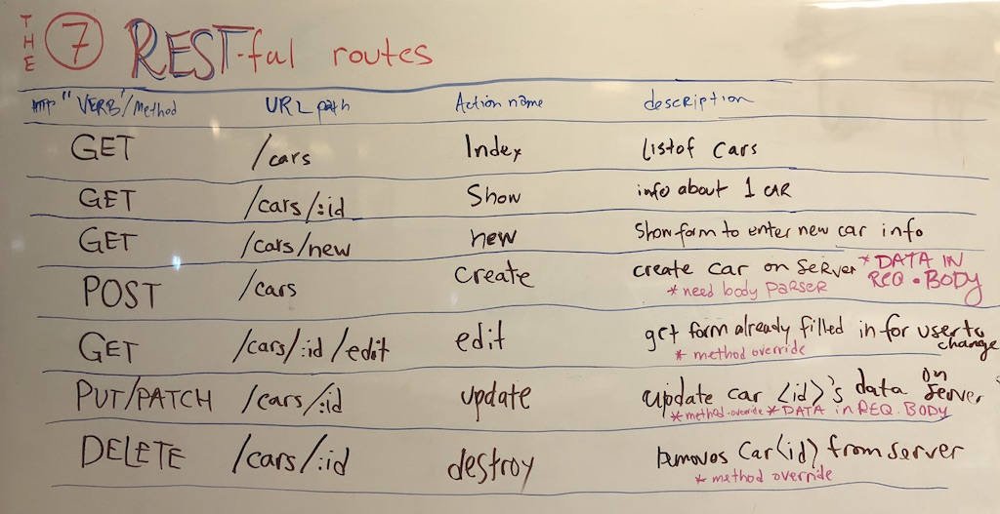

# Pokemon Express Rest

Make a Pokemon app that displays data inside server-side rendered views.


## BE RESTful!!!

The final app should have what are known as the 7 RESTful routes. 



## App

User Stories
- When a user goes to the `/pokemon` route they will see an "index" of pokemon: the names of each pokemon rendered to the page.
- When a user clicks on the name of the pokemon, they will be taken to that pokemon's "show" page, and will see the pokemon's name and image.


### Set up your server

- Create an express app that listens on port 3000. Ensure that you have installed the necessary npm packages to run an express server and render templates. You can refer back to old code and lessons but **TYPE IT OUT.  DO NOT PASTE.** 

&#x1F534; **Commit:** "Server is set up and running"


### Set up your _'database'_ and create an "index" route
- Create a `models` directory, and inside of that, a file called `pokemon.js`.
- Inside of this file, put the following array of pokemon objects. This is your "database" for tonight's homework.

```javascript
const pokemon = [ 
  {
    name: "Bulbasaur", 
    img: "http://img.pokemondb.net/artwork/bulbasaur.jpg"
  },
  {
    name: "Ivysaur", 
    img: "http://img.pokemondb.net/artwork/ivysaur.jpg"
  },
  {
    name: "Venusaur", 
    img: "http://img.pokemondb.net/artwork/venusaur.jpg"
  },
  {
    name: "Charmander", 
    img: "http://img.pokemondb.net/artwork/charmander.jpg"
  },
  {
    name: "Charizard", 
    img: "http://img.pokemondb.net/artwork/charizard.jpg"
  },
  {
    name: "Squirtle", 
    img: "http://img.pokemondb.net/artwork/squirtle.jpg"
  },
  {
    name: "Wartortle", 
    img: "http://img.pokemondb.net/artwork/wartortle.jpg"
  }
];

```
- Set up your "database" in so that it can be exported to your `server.js` and then be required by your `server.js`

- Create an "index" route at `GET /pokemon` that will `res.send(pokemon)`, which will display your pokemon data as json in the browser.

&#x1F534; **Commit:** "Connected models/database, can see json in the browser at GET /pokemon"


### Set up your "index" view

- Instead of displaying json at your `/pokemon` route, you should serve an `index.ejs` file that displays a list of all the pokemon. Put the pokemon inside a `<ul>` with class name `pokemon`. 

&#x1F534; **Commit:** "Index template rendered at GET /pokemon"

### Style your app, step 1: static

 - Set up your app to be able to use CSS like we did in class.  Use a dummy (i.e. just set a background color) CSS declaration.  Remember: you need `express.static()` middleware. (Also remember that you don't need to npm install anything for this particular middleware because its part of express. But for others you do.)

&#x1F534; **Commit:** "Set up serving of static files so we can add CSS"

### Style your app, step 2: actually style it

- Add some style to your list using static files in an express app and use a separate css file.
  
- **Stretch step, not required, just for fun**: Choose a google font and use it to style your pokemon's name etc.

&#x1F534; **Commit:** "The app is styled"


### Set up your "show" route

- Inside your `server.js`, add the show route at `GET /pokemon/:id`

- This route should serve a template called `show.ejs` which displays the information of a specific pokemon according to their index in the pokemon array. For example, `/pokemon/0` should display the 0-indexed pokemon.

&#x1F534; **Commit:** "Show page shows details for one pokemon"


### Link your `index.ejs` to your `show.ejs`
Inside your `index.ejs`,
- for each pokemon, add an `<a>` tag that will have an `href` that goes to the route `/pokemon/x`, where x is the array position of the `pokemon` in the data array. This should be set dynamically in the loop in your `index.ejs` template.
- Clicking the link should take the user to to your show route for that pokemon, and the pokemon at the index number corresponding to the pokemon's array position should be displayed.

&#x1F534; **Commit.** "Added links on index page"

### Partials

Sites should be _navigable_. Users do not want to type in URLs to access different parts of your site, and you shouldn't waste time with that either.

- Now that you have enough of a site to be meaningful, create `header.ejs` and `footer.ejs` partials.  The header should include everything up through the opening `<body>` tag.  The footer should probably start with the closing`</body>` tag.

- Replace the opening html in each template with your `header.ejs` and replace the closing html with your `footer.ejs`

Your site will look the same, but it is much DRYer now and easier to modify. Check to make sure it _still_ looks right, if so, then...

&#x1F534; **Commit.** "Set up partials"

### Nav

Put a `<nav>` in the header with links to the things users would want to be able to do at any time (like: seeing index and adding an item).  Isn't that nice that you only had to add that in one place?

&#x1F534; **Commit.** "Added navigation links"


## Complete CRUD functionality...

Time to finish out the app to allow for full CRUD functionality......

### "new"

- Users should be able to add a new pokemon into the array using a form on 
a `new.ejs` page by requesting `GET /pokemon/new` with their browser.

&#x1F534; **Commit.** "It shows a form for users to enter new pokemon"


### "create"

- That form should hit a route Creation should be handled via a route at `POST /pokemon`. (Remember: body-parser!!!).  After the pokemon is created, user should be redirected to the index.

&#x1F534; **Commit.** "Submitting the form actually creates a pokemon"


### "delete"

- Users should be able to delete a pokemon using a button provided on the show and index pages. (Remember: method-override!!!) After the pokemon is deleted, user should be redirected to the index.

&#x1F534; **Commit.** "User can delete a pokemon"


### "edit"

- Users should be able to edit an individual pokemon on an `edit.ejs` page accessed from the `GET /pokemon/:id/edit` route. Users should be able to click an "(edit)" link on either the index or show route (or both!) to access this page.

&#x1F534; **Commit.** "User can see a form to edit a pokemon with data already populated"

### "update"

The updating should be handled via a PUT request to the `/pokemon/:id` route. After the pokemon is updated, user should be redirected to either the index or the show page, you decide which you like better.

&#x1F534; **Commit.** "User can update the info for a pokemon"


# NICE. You're done! Push and make a pull request.  Then finish your old homework.


## Hungry for more?

1. Style your application with flexbox, or [Bootstrap!](https://getbootstrap.com/docs/4.1/getting-started/introduction/), a CSS library created by Twitter to make using the [960px grid system](https://960.gs/demo.html) a little easier. Or there's a substantially more lightweight 960px-grid-system-based answer to Bootstrap called [Skeleton](http://getskeleton.com/). You could also jazz up your app by adding some hand-rolled flourishes with CSS animations, and/or some sweet client-side jQuery and/or ....??? u pick???.....!

2. Learn more about Pseudo Selectors to become a CSS Genius
  - [pseudo selector links](https://www.youtube.com/watch?v=YMZGPqNDn_s&list=PLdnONIhPScST0Vy4LrIZiYKpFNoxgyH7J&index=17) ~ 5 minutes
  - [pseudo selector children](https://www.youtube.com/watch?v=tMCahu7H-fA&list=PLdnONIhPScST0Vy4LrIZiYKpFNoxgyH7J&index=18) ~ 4 minutes
  - [pseudo selector n-th child](https://www.youtube.com/watch?v=yFmwjX9oGt8&list=PLdnONIhPScST0Vy4LrIZiYKpFNoxgyH7J&index=19) ~ 3 minutes
  - [pseudo selector sibling status and `not()`](https://www.youtube.com/watch?v=XyXUjEP9m-8&list=PLdnONIhPScST0Vy4LrIZiYKpFNoxgyH7J&index=20) ~ 5 minutes
  - a little glitchy, but [See just how deeply nerdy some people get about CSS](https://css-tricks.com/roman-empire-made-pure-css-connect-4-possible/)

3. Sign up for [Code Wars](https://www.codewars.com/) and/or [HackerRank](https://www.hackerrank.com/) and/or [Project Euler](https://projecteuler.net/) and try out a challenge (or a few!) in order to keep honing your JavaScript skills! These are the same types of questions people ask in interview coding challenges.


